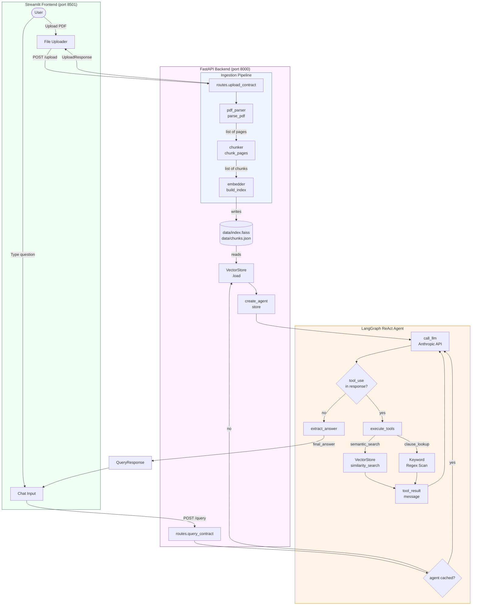

# Architecture — Contract Clause Q&A Agent

## Table of Contents

1. [System Overview](#1-system-overview)
2. [Design Goals](#2-design-goals)
3. [Data Flow](#3-data-flow)
4. [Mermaid Diagram](#4-mermaid-diagram)
5. [Module Reference](#5-module-reference)
6. [Why LangGraph ReAct](#6-why-langgraph-react)
7. [Tech Stack Choices](#7-tech-stack-choices)
8. [Future Improvements](#8-future-improvements)

---

## 1. System Overview

The Contract Clause Q&A Agent is a retrieval-augmented generation (RAG) system that allows users to upload a contract PDF and ask natural language questions about its content. The agent reasons over the document using two complementary retrieval tools — semantic vector search and structured clause-type lookup — before producing a cited, grounded answer.

The system is split into three layers:

| Layer | Technology | Responsibility |
|-------|-----------|----------------|
| **Frontend** | Streamlit | File upload UI, persistent chat interface |
| **Backend API** | FastAPI + Uvicorn | Ingestion pipeline, agent orchestration, HTTP interface |
| **Agent core** | LangGraph + Anthropic SDK | ReAct reasoning loop, tool execution, answer generation |

The frontend and backend communicate over HTTP so they can be deployed and scaled independently.

---

## 2. Design Goals

| Goal | Decision |
|------|----------|
| **Grounded answers only** | Agent must call a retrieval tool before answering; system prompt enforces this |
| **Cited responses** | Every tool result includes page number and chunk text; agent is instructed to quote them |
| **Modular ingestion** | Parse → chunk → embed are separate functions so each step can be swapped or tested independently |
| **Stateless queries** | FAISS index and chunk metadata are persisted to disk; the API can cold-start and serve queries without re-uploading |
| **No LangChain dependency** | Raw Anthropic SDK is used for LLM calls inside LangGraph, keeping the dependency surface minimal |
| **Fast local embeddings** | `all-MiniLM-L6-v2` runs fully locally — no embedding API calls, no latency, no cost per token |

---

## 3. Data Flow

### Upload path

```
User selects PDF
    │
    ▼
Streamlit (frontend/app.py)
    │  POST /upload  (multipart/form-data)
    ▼
FastAPI /upload route (app/api/routes.py)
    │
    ├─► pdf_parser.parse_pdf()          → list[{page_num, text}]
    │       pdfplumber extracts text per page; skips image-only pages
    │
    ├─► chunker.chunk_pages()           → list[{chunk_id, page_num, text}]
    │       Sliding window, 1000-char chunks, 200-char overlap
    │
    ├─► embedder.build_index()          → writes data/index.faiss + data/chunks.json
    │       sentence-transformers encodes all chunks
    │       Vectors L2-normalised → IndexFlatIP (cosine similarity)
    │
    └─► VectorStore.load()  +  create_agent(store)
            Warms app.state so first query is instant
```

### Query path

```
User types question
    │
    ▼
Streamlit chat input
    │  POST /query  {"question": "..."}
    ▼
FastAPI /query route
    │
    ▼
LangGraph ReAct agent (app/agent/graph.py)
    │
    ├─[call_llm node]──────────────────────────────────────────────────────┐
    │   Anthropic claude-sonnet-4-6                                        │
    │   Receives: system prompt + full message history + tool schemas      │
    │   Returns: text block(s) and/or tool_use block(s)                    │
    │                                                                       │
    ├─[should_continue]  ── tool_use present? ──► [execute_tools node] ───┘
    │                    └─ no tool calls?    ──► [extract_answer node]
    │
    ├─[execute_tools node]
    │   For each tool_use block:
    │   ├─ "semantic_search"  → VectorStore.similarity_search(query, k)
    │   └─ "clause_lookup"   → regex keyword scan over stored chunks
    │   Appends tool_result message to state, loops back to call_llm
    │
    └─[extract_answer node]
        Concatenates all text blocks from final assistant message
        Returns final_answer string
    │
    ▼
FastAPI returns {"question": "...", "answer": "..."}
    │
    ▼
Streamlit renders answer in chat window
```

---

## 4. Mermaid Diagram



---

## 5. Module Reference

| # | File | Key design decision |
|---|------|---------------------|
| 1 | `app/core/config.py` | `pydantic-settings` validates env at startup; index paths are `@property` off `BASE_DIR` so they resolve correctly regardless of working directory |
| 2 | `app/ingestion/pdf_parser.py` | `pdfplumber` is used over `pypdf` for more reliable text-block ordering on complex contract layouts; empty pages are silently skipped |
| 3 | `app/ingestion/chunker.py` | Character-level sliding window (not sentence or paragraph splitting) to avoid dependency on NLP tokenisers; pages shorter than `CHUNK_SIZE` are kept whole to prevent splitting short clauses |
| 4 | `app/ingestion/embedder.py` | Vectors are L2-normalised before indexing so `IndexFlatIP` (inner product) equals cosine similarity — avoids needing `IndexFlatL2` with a separate normalisation step at query time |
| 5 | `app/vectorstore/store.py` | `VectorStore.load()` returns `bool` rather than raising, allowing the query route to give a human-readable 400 error instead of a 500 crash |
| 6 | `app/agent/tools.py` | Keyword registry uses regex substring patterns (e.g. `"terminat"` catches terminated/termination/terminates); `get_tool_executor` returns a closure so the store is bound once per session, not looked up on every call |
| 7 | `app/agent/graph.py` | Anthropic SDK objects (`TextBlock`, `ToolUseBlock`) are serialised to plain dicts via `_serialize_content` before being stored in LangGraph state, keeping state JSON-serialisable and avoiding Pydantic object drift across graph iterations |
| 8 | `app/api/schemas.py` | `QueryRequest.question` has `min_length=1` so FastAPI's validation layer rejects blank questions before the agent is ever invoked |
| 9 | `app/api/routes.py` | `_get_or_load_agent` checks `app.state.agent` first, then falls back to loading the persisted index from disk — the server can restart without requiring a re-upload |
| 10 | `app/main.py` | `app.state` is used as an in-process cache rather than Redis or a file lock, keeping the dev setup to a single process with zero external dependencies |
| 11 | `frontend/app.py` | Chat history is stored in `st.session_state` (not the API) so the backend stays stateless; both API calls carry a 120s timeout to accommodate cold model loads |

---

## 6. Why LangGraph ReAct

### The alternative: a simple RAG chain

A naive implementation would be:

```
question → embed → FAISS search → stuff chunks into prompt → LLM → answer
```

This works for simple factual lookups but breaks down in practice:

- **Single retrieval shot.** If the first search misses the relevant clause, there is no recovery path. The LLM answers from incomplete context or hallucaintes.
- **No clause-type routing.** A user asking "what are the termination conditions?" benefits from a keyword scan (which catches all termination chunks regardless of phrasing) *and* a semantic search (which catches related concepts like notice periods). A chain can't decide between the two.
- **No self-correction.** The model cannot notice that a search returned irrelevant results and retry with a rephrased query.

### How ReAct solves this

ReAct (Reason + Act) gives the LLM an explicit loop:

1. **Reason** — decide which tool to call and why
2. **Act** — call the tool and observe the result
3. **Repeat** — if the result is insufficient, reason again and call another tool
4. **Respond** — only produce a final answer when enough evidence has been gathered

In practice, the agent for this system typically:
- Calls `clause_lookup("termination")` to find all termination chunks by keyword
- Then calls `semantic_search("how many days notice is required to terminate?")` to surface the specific numeric condition
- Synthesises both results into a cited answer

Neither tool alone would surface the complete answer; the ReAct loop lets the model combine them adaptively.

### Why LangGraph over LangChain's `create_react_agent`

| Concern | LangChain `create_react_agent` | LangGraph `StateGraph` |
|---------|-------------------------------|------------------------|
| LLM coupling | Requires a `BaseChatModel` — forces `langchain-anthropic` as a dependency | Any callable; we use the raw `anthropic` SDK |
| State visibility | Opaque internal chain | Explicit `AgentState` TypedDict — easy to inspect and extend |
| Control flow | Fixed ReAct template | Custom conditional edges — easy to add human-in-the-loop, retries, or parallel tool calls |
| Streaming | Requires LangChain streaming interface | Can add `StreamWriter` at the node level |

LangGraph adds ~150 lines of boilerplate over a bare loop, but in exchange every state transition is explicit, testable, and extensible.

---

## 7. Tech Stack Choices

| Component | Choice | Reasoning |
|-----------|--------|-----------|
| **LLM** | `claude-sonnet-4-6` (Anthropic) | Best-in-class instruction following and tool use; native tool-use API (no prompt-engineering workarounds needed) |
| **Agent framework** | LangGraph `StateGraph` | Explicit state machine without LangChain model coupling; conditional edges make the ReAct loop readable |
| **Embeddings** | `all-MiniLM-L6-v2` (sentence-transformers) | Runs fully locally; 384-dim vectors are fast to index and search; strong benchmark performance for semantic similarity on English text |
| **Vector store** | `faiss-cpu` `IndexFlatIP` | Zero infrastructure — single `.faiss` file on disk; exact search (no approximation error) is fast enough for contract-sized corpora (<10k chunks) |
| **PDF parsing** | `pdfplumber` | Superior text-block ordering on multi-column and table-heavy contract layouts compared to `pypdf` |
| **API** | FastAPI + Uvicorn | Async-native, automatic OpenAPI docs at `/docs`, Pydantic validation built in |
| **Frontend** | Streamlit | Fastest path from Python function to interactive UI; `st.session_state` gives persistent chat history with no client-side JS |
| **Config** | `pydantic-settings` | Type-validated env vars with `.env` file support; fails loudly at startup if `ANTHROPIC_API_KEY` is missing |

---

## 8. Future Improvements

### Containerisation

Package the backend and frontend as separate Docker images behind a `docker-compose.yml`:

```
services:
  api:   build: ./  command: uvicorn app.main:app --host 0.0.0.0 --port 8000
  ui:    build: ./  command: streamlit run frontend/app.py --server.port 8501
```

Benefits: reproducible environments, isolated dependencies, simple horizontal scaling of the API tier.

### Kubernetes deployment

For production scale:
- API pods behind a `ClusterIP` service; `HorizontalPodAutoscaler` on CPU/request rate
- FAISS index served from a shared `PersistentVolumeClaim` (or replaced with a managed vector DB — see below)
- Streamlit as a separate `Deployment` behind an `Ingress`

### Managed vector database

Replace `faiss-cpu` with **Pinecone**, **Weaviate**, or **pgvector** for:
- Multi-user support (per-user namespaces)
- Persistent storage without a shared filesystem
- Metadata filtering (e.g. search only within a specific contract date range)

### Multi-document support

Currently one contract overwrites the previous index. Add a `contract_id` namespace to FAISS metadata so multiple contracts can coexist, and add a `contract_id` filter to both tools.

### Streaming responses

Use Anthropic's `client.messages.stream()` and FastAPI's `StreamingResponse` to push tokens to the Streamlit frontend as they arrive via Server-Sent Events, eliminating the perceived latency of long answers.

### Evaluation framework

Use **RAGAS** (Retrieval-Augmented Generation Assessment) to measure:

| Metric | What it measures |
|--------|-----------------|
| `context_precision` | Are retrieved chunks actually relevant to the question? |
| `context_recall` | Did retrieval miss any relevant clauses? |
| `faithfulness` | Is the answer grounded in the retrieved chunks (no hallucination)? |
| `answer_relevancy` | Does the answer address the question asked? |

Build a golden dataset of 50–100 contract Q&A pairs and run RAGAS on every pull request to catch retrieval or reasoning regressions before they reach production.

### Authentication & multi-tenancy

Add OAuth2 / JWT authentication to the FastAPI layer so each user's uploaded contracts are isolated. Store index files under `data/{user_id}/` and scope `app.state` per session or move to a distributed cache (Redis) for multi-worker deployments.

### OCR support

Integrate `pytesseract` or `AWS Textract` as a fallback in `pdf_parser.py` for scanned PDFs where `pdfplumber` returns empty pages. Currently such PDFs return a 422 error with a clear message.
