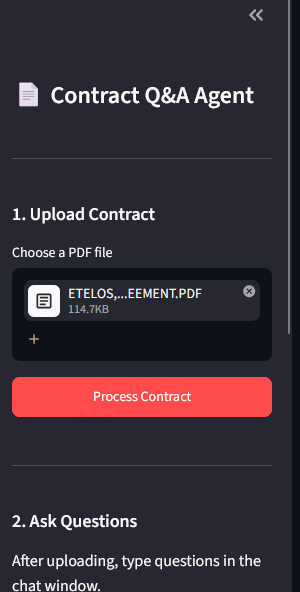
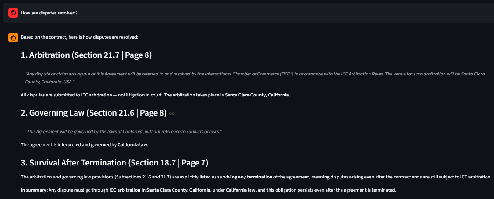

# Contract Clause Q&A Agent

A RAG-based agent that lets users upload a contract PDF and ask natural language questions about its clauses. Built with LangGraph (ReAct), FAISS, sentence-transformers, and Streamlit.

**[Live Demo](https://contract-app-agent-7thrqohxvb5up5se7utefy.streamlit.app/)**

---

## Screenshots

<!-- Add screenshots here -->
<!-- Suggested: upload images to a `screenshots/` folder and reference them like: -->
<!--  -->
<!--  -->

---

## How It Works

```
User uploads PDF
    └── pdfplumber extracts text per page
        └── Sliding-window chunker (1000 chars, 200 overlap)
            └── sentence-transformers embeds chunks → FAISS index

User asks a question
    └── LangGraph ReAct agent (claude-sonnet-4-6)
        ├── Tool: semantic_search  → FAISS cosine similarity search
        └── Tool: clause_lookup   → keyword scan by clause type
            └── Cited answer returned to user
```

---

## Folder Structure

```
contract-qa-agent/
├── app/
│   ├── core/config.py             # Settings (reads ANTHROPIC_API_KEY from env)
│   ├── ingestion/
│   │   ├── pdf_parser.py          # PDF bytes → per-page text (pdfplumber)
│   │   ├── chunker.py             # Text → overlapping chunks
│   │   └── embedder.py            # Chunks → embeddings → FAISS index
│   ├── vectorstore/store.py       # FAISS load / similarity search wrapper
│   ├── agent/
│   │   ├── tools.py               # semantic_search + clause_lookup definitions
│   │   └── graph.py               # LangGraph ReAct graph (raw Anthropic SDK)
│   ├── api/
│   │   ├── routes.py              # POST /upload, POST /query (optional backend)
│   │   └── schemas.py             # Pydantic request/response models
│   └── main.py                    # FastAPI entrypoint (optional, local use)
├── frontend/
│   └── app.py                     # Streamlit UI — standalone, no backend needed
├── data/                          # Runtime: FAISS index + chunk metadata
├── packages.txt                   # Streamlit Cloud system packages (none needed)
├── requirements.txt
├── .env.example
├── ARCHITECTURE.md
└── README.md
```

---

## Local Setup

### Prerequisites

- Python 3.11+
- An [Anthropic API key](https://console.anthropic.com/)

### Install

```bash
git clone https://github.com/absrimankar/contract-qa-agent.git
cd contract-qa-agent
python -m venv .venv

# Activate virtualenv
.venv\Scripts\activate        # Windows
source .venv/bin/activate     # macOS / Linux

pip install -r requirements.txt
```

### Configure

```bash
cp .env.example .env
```

Open `.env` and set your key:

```
ANTHROPIC_API_KEY=sk-ant-...
```

### Run (Streamlit standalone — recommended)

```bash
python -m streamlit run frontend/app.py
```

Open **http://localhost:8501** in your browser.

### Run (with FastAPI backend — optional)

If you want the REST API available separately:

```bash
# Terminal 1 — backend
python -m uvicorn app.main:app --reload --port 8000

# Terminal 2 — frontend (update API_BASE in frontend/app.py if needed)
python -m streamlit run frontend/app.py
```

API docs available at **http://localhost:8000/docs**.

---

## Streamlit Cloud Deployment

1. Fork or clone this repo to your GitHub account
2. Go to **[share.streamlit.io](https://share.streamlit.io)** → **New app**
3. Select your repo and set **Main file path** to `frontend/app.py`
4. Under **Advanced settings → Secrets**, add:

```toml
ANTHROPIC_API_KEY = "sk-ant-..."
```

5. Click **Deploy**

No Docker, no backend server, no extra infrastructure needed. Streamlit Cloud installs `requirements.txt` automatically.

---

## Tech Stack

| Component | Library | Version |
|-----------|---------|---------|
| LLM | Anthropic (`claude-sonnet-4-6`) | `>=0.40.0` |
| Agent framework | LangGraph `StateGraph` | `>=0.2.0` |
| Embeddings | sentence-transformers (`all-MiniLM-L6-v2`) | `>=3.0.0` |
| Vector store | faiss-cpu | `>=1.8.0` |
| PDF parsing | pdfplumber | `>=0.11.0` |
| Frontend | Streamlit | `>=1.40.0` |
| API (optional) | FastAPI + Uvicorn | `>=0.115.0` |

---

## Architecture

See [ARCHITECTURE.md](ARCHITECTURE.md) for a full design doc including Mermaid diagrams, module decisions, and future improvement plans (Docker, Kubernetes, RAGAS evaluation).
